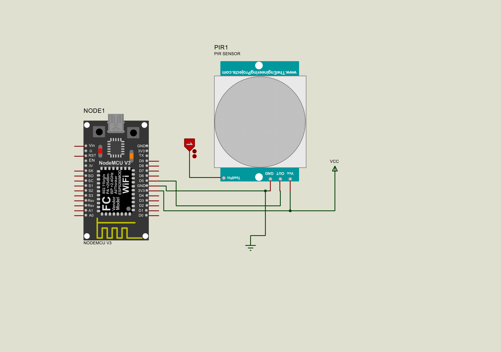

# Interfacing of PIR Sensor with ESP8266 NodeMCU
## Content

1. [Overview](#overview)
2. [Components Required](#components)
3. [Circuit Diagram](#circuit-diagram)
4. [Software Required](#software-required)
5. [Libraries Requried](#libraries-requried)
6. [Project Flow](#project-flow)
7. [Output](#output)

## Overview
This project interfaces PIR sensor with an ESP8266 (NodeMCU) to detect the motion and upload the data to ThingSpeak.

## components
- ESP8266 NodeMCU
- PIR Sensor
- Breadboard and jumper wires
- USB cable 

## Circuit Diagram

## Software Required
- [VS Code](https://code.visualstudio.com/)
- [PlatformIO](https://platformio.org/)
- [ThingSpeak Account](https://thingspeak.com/)

## Libraries Requried
- ESP8266WiFi
- ESP8266WebServer
- ThingSpeak
- DNSServer
- Arduino

## Project Flow

### Serial Communication Setup:
- Serial.begin(115200): Initializes serial communication at a baud rate of 115200 for debugging purposes

### WiFi Connection Setup:
- WiFi.begin(ssid, password): Attempts to connect to the specified WiFi network using the provided SSID and password.
- while (WiFi.status() != WL_CONNECTED) { ... }: Waits until the ESP8266 successfully connects to the WiFi network, printing dots (.) to indicate connection progress.

### Main Loop:
- val = digitalRead(pirPin);: Reads the current state of the PIR sensor. val will be HIGH if motion is detected and LOW if no motion is detected.
- if (val == HIGH) { ... } else { ... }: Checks if the PIR sensor detects motion (val == HIGH).
- Motion Detected (val == HIGH):
   If pirState is LOW (meaning no previous motion was detected):
   Prints "Motion detected!" to the serial monitor.
   Sets pirState to HIGH to indicate motion is now detected.
-No Motion Detected (val == LOW):
   If pirState is HIGH (meaning previous motion was detected):
   Prints "Motion ended!" to the serial monitor.
   Sets pirState to LOW to indicate no motion is currently detected.
- Sends the updated Data to ThingSpeak on the specified channel and field 

 ## Output
- Link of Thingspeak channel Data :
- 
  
  
